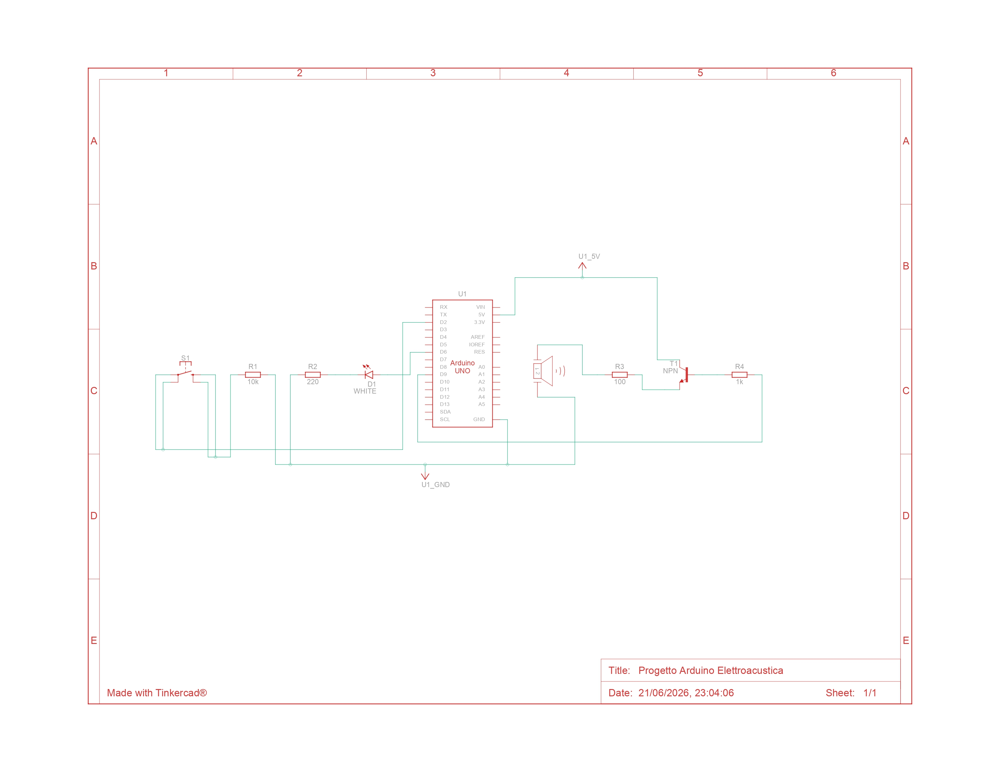
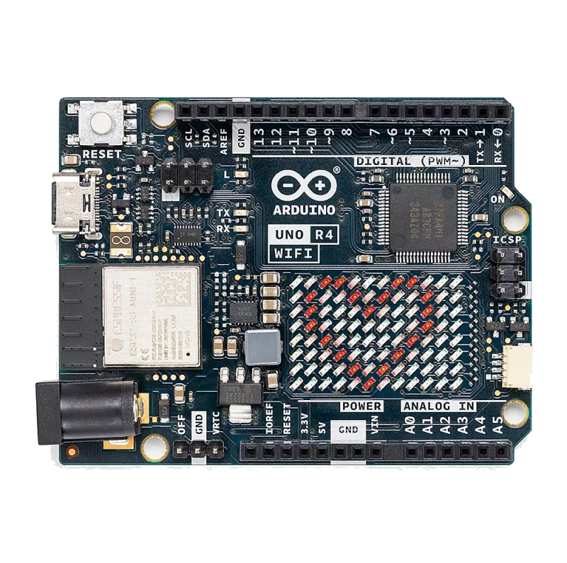

# Elettroacustica
### Danesi Gabriele (Matricola N. T-00053)
#### Creazione di un sistema di comunicazione Morse per Terminale
---

## Idea di Partenza

Poter creare un sistema che possa ricreare l'intro del brano *Glitter Freeze* di Gorillaz in modo veloce

---

## Componenti Elettronici Utilizzati

Oltre all'utilizzo di cavi jumper, di Arduino UNO Q R4 con caricato il codice e un computer con accesso a terminale che possa leggere ASCII sono stati utilizzati

- Resistenza (100Ω) * 1
- Resistenza (220Ω) * 1
- Resistenza (1kΩ) * 1

- Led Bianco * 1
- Diffusore Acustico * 1
- Transistor NPN * 1

---

## Collegamenti Elettrici

Verrà scritto nel verso in cui si muove la corrente

DPin6-->Res(220Ω)-->AnodoLED-->CatodoLED-->GND
DPin9-->Res(1kΩ)-->Transistor(BASE)
5V-->Transistor(COLL.)
Transistor(EMETT.)-->Res(100Ω)-->Diffusore-->GND

---
<!---_backgroundColor: #ffffff--->

---

## Il codice: Global Value
Oltre alle inizializzazioni dei PIN è stata creato un array di stringhe, contenente dal valore array [0] a [25] la sequenza di punti e linee per le lettere dell'alfabeto, dal [26] al [35] quelle per i numeri, mentre il valore [36] e [37] (rispettivamente spazio e backspace) sono stati creati per facilitare la scrittura di testo in morse

---

## Il codice: void setup

Inizializzazione del Seriale e definizione dei PIN in valore di scrittura o lettura. Per evitare un suono che sia un'onda quadra, occorre sfruttare la funzione PWM dell'arduino, presente solo nei PIN con il simbolo ~

---
## Il codice: void loop

La parte di loop è divisa in due sezioni: quella che legge dal terminale e invia all'esterno il testo tradotto in codice morse // e quella che trasforma il codice morse inviato dal bottone in testo stampato a schermo

---

## Il codice: Le Funzioni Esterne

Le due funzioni esterne sono quelle richiamate rispettivamente per inviare il segnale di punti e linee di una lettera ai rispettivi pin (void) e per trasformare una stringa di punti e linee in un simbolo (char)

---

## IA??

// Sì, è stata utilizzata l'IA nella fase 'grafica'. Il codice che crea i punti e le linee durante la fase di scrittura e poi la relativa cancellazione è stato fatto con l'aiuto di Gemini Pro 2.5

---
# Fine
Grazie per l'attenzione
